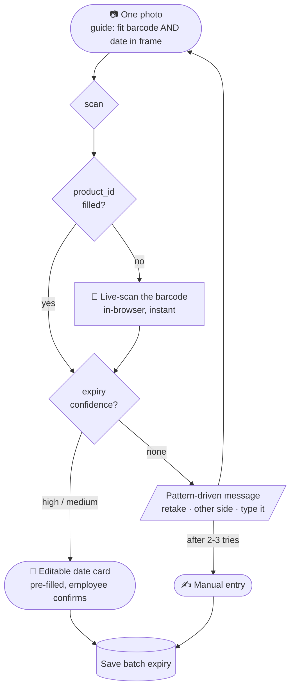

# Scanify — Frontend Plan

Capture flow for the mobile web app (PWA). This is a **planning document**,
not an implementation — it fixes the interaction model and the contract with
the backend so the UI can be built without re-litigating the decisions.

Backend it talks to: [`backend/app/scanner.py`](../backend/app/scanner.py) →
`scan(image)` returns barcode(s), raw OCR text, and a parsed expiry.

---

## 1. Two modes

| Mode | Purpose | Camera | Status |
|---|---|---|---|
| **Audit** | Identify a product on the shelf | Live barcode scan only | ⚠️ scope TBD — barcode + live camera is all that's confirmed |
| **Expiry capture** | Backfill the missing expiry date | Still photo + live-scan rescue | ✅ designed below |

Everything below describes **Expiry capture**.

---

## 2. The core principle: two slots, no photo budget

The instinct is to think "photo 1 = barcode, photo 2 = expiry." Don't. The
employee should never have to declare what a photo is *for*, and the system
should never have to guess.

The session has **two slots to fill**:

```
NEED:   [ product_id ]      [ expiry_date ]
```

Every photo goes to `POST /scan` and whatever comes back drops into whichever
slot is still empty. The UI only ever asks for **what is still missing**.

Each slot has its own rescue when a photo does not fill it:

| Slot | If the photo does not supply it |
|---|---|
| `product_id` | **Live barcode scan** — instant, in-browser, near-100% |
| `expiry_date` | **Take another photo** — usually of a different face |

**There is no "max 2 photos" rule.** An earlier draft capped the session at
two; it was dropped because the cap is a concept the employee has to learn,
and it forces an awkward decision about whether a blurry shot burns a slot.
The employee simply keeps going until both slots are full — bounded by the
retry rules in §5, not by a counter.

## 3. The flow



### Why one photo first, not a scan first

A single photo makes a product/date mismatch **physically impossible** —
same frame, same pack. Leading with a live barcode scan would turn that
guarantee into a risk for the majority case that never needed it.

Live scanning is therefore a **rescue**, used only when the photo failed to
find a barcode — which is the single largest failure bucket.

### Step 1 is where the accuracy is

Measured on the sample set: **only 36% of photos yielded both**, yet ~60-70%
of packs carry both on one face. The gap is pure framing — 22 of 58 photos
had no barcode in frame at all, and 5 more had it sliced by the frame edge.

> **The capture guide on the first screen is the highest-value element in the
> whole UI.** Show both targets, and hint live when a barcode is detected in
> view. This recovers more accuracy than any model change available to us.

## 4. Screens

### 4.1 Capture

**Full-bleed camera with the info as an overlay** — not a split screen.

Framing is the single biggest lever on accuracy, so the viewfinder gets the
whole screen. Everything the employee needs to see is overlay-shaped anyway:

| Overlay | Where |
|---|---|
| What is still needed | small chip, top |
| Framing guide — "barcode" + "date panel" outlines | over the preview |
| ✓ badge when a barcode is detected in view | corner |
| Previous photo, once a retake is in progress | thumbnail, corner |

Copy on first open: *"Fit the barcode and the date in one shot."*

**Keep one camera stream alive for the whole session.** Do not tear down and
re-open `getUserMedia()` between the photo and the live scan — restarting
costs about a second and flickers. Hold the stream; only change what you do
with the frames.

### 4.2 Live barcode scan (rescue)

Shown only when a photo did not yield a barcode. Runs **entirely in the
browser** (`BarcodeDetector` API, or ZXing-JS as fallback) — no upload, no
server round trip, retries every frame until a code decodes with a valid
check digit.

**The scan is a deliberate, aimed act** — the employee points at one specific
barcode and watches it register. That visibility is what makes it safe.

> **Rejected: continuous background scanning.** An earlier draft proposed
> reading barcodes from every frame while the employee aims, so the code
> would be captured passively. It was dropped because it silently breaks the
> guarantee the whole flow is built on:
>
> - **Silent mismatch.** A neighbouring pack's barcode on a full shelf can be
>   captured with nobody looking. The employee then photographs the right
>   pack and the record is wrong, with no signal anywhere that it happened.
> - **"Take the last scanned" has no justification** — it means "whatever
>   drifted past most recently", which is often the shelf neighbour swept
>   over while lifting the pack to the camera.
> - **It defeats the multi-barcode picker** (§4.3). Six valid codes appear in
>   one real sample; continuous scanning would lock one in silently and never
>   ask.
>
> This is the same flaw that ruled out scan-first in §3 — decoupling the
> barcode from the photo moment — just harder to notice.

### 4.3 Multi-barcode picker

Sample 42 in the test set contains **six** valid EAN-13 barcodes (a multipack
carton); sample 38 has two. Never silently take the first.

When `barcode.retail_count > 1`:

- Show the captured photo
- Draw a tap-target box over each detected barcode using **`box_norm`**
  (normalised 0-1, so it scales to any display size)
- Label each with its decoded value
- Employee taps the right one, filling the `product_id` slot

```
values[].box_norm = { x, y, w, h }   // fractions of image width/height
values[].corners  = [[x,y], ...]     // exact quad if the code is rotated
```

### 4.4 The date card

**Always editable — at every confidence level.** The parser currently returns
zero wrong dates, but that is measured across 44 images. Trust is earned in
the pilot, not assumed on day one, and a wrong expiry marks an entire batch
wrong. So the date is always a field the employee can correct, never a value
they can only accept.

One component, three states:

| Confidence | Measured | Card |
|---|---:|---|
| `high` | 22/44 | Date pre-filled, **green**, editable. Confirm. |
| `medium` | 10/44 | Date pre-filled, **amber**, editable, **with `expiry.reason` shown** ("derived from manufacture + 24 months"). |
| `none` | 12/44 | **Empty field.** Offer a retake first (§5), then let them type. |

> The amber state matters. If `medium` looks identical to `high` it will be
> reflex-tapped, and the entire value of the confidence signal is lost.

Also on the card: the product identifier, so the employee can see they are
confirming the right thing. Until the Phase 2 catalogue lookup exists this is
the **raw barcode number** rather than a product name.

## 5. When the date is not found, say *what to do differently*

"Try again" is wrong most of the time. Re-photographing a pack that says
"see below" can never work, and the employee loses trust in the tool fast.
The parser reports **which pattern** it hit — use it.

| `expiry.pattern` | Retaking the same face… | UI message |
|---|---|---|
| `E11_missing_or_blank` | might help — likely a poor photo | **"Try again"** |
| `E9_indirection` | useless — pack says "as printed on pack" | **"Check another side"** |
| `E4_mfg_only_shelf_life_unknown` | useless — the date is not printed | **"Enter the date"** |
| `E10_use_within_of_opening` | useless — no fixed expiry exists | **"Skip this one"** |

On the scored set the 12 no-answer cases are **10 × `E11`** (a retake is
worth trying) and **2 × `E4`** (a retake is pointless). So "try again" is
right most of the time — but without the other messages, roughly 1 in 6
employees hits a dead end with no way forward.

**Escape hatch.** Dropping the two-photo cap also dropped the natural
stopping point, so this replaces it: after **2-3 failed attempts, always
offer manual entry.** Never let anyone loop on a pack whose date genuinely
cannot be read.

## 6. Mismatch safeguards

A mismatch — barcode of product A, expiry of product B — is impossible while
everything comes from one frame, and becomes possible the moment a retake is
involved. Three cheap defences:

1. **Cross-check every retake, free.** If a later photo also contains a
   barcode, compare it with the one already held. Different → flag and do not
   save. This catches the "wrong pack picked up" error directly.
2. **Show the identifier on screen** during a retake, so the employee can see
   which product the session is already bound to.
3. **Prefer the passive-scan model** (§4.2): if the barcode is read from the
   same frames as the photo, the mismatch window never opens at all.

## 7. What the frontend needs from the API

Currently `scan()` returns this shape (already implemented):

```jsonc
{
  "image": "samples2/sample 5.jpg",
  "image_size": { "w": 900, "h": 1600 },
  "barcode": {
    "ok": true, "count": 1, "retail_count": 1,
    "values": [{
      "value": "8906183110319", "format": "EAN13", "is_retail": true,
      "box":      { "x": 179, "y": 1127, "w": 414, "h": 165 },
      "box_norm": { "x": 0.199, "y": 0.704, "w": 0.46, "h": 0.103 },
      "corners":  [[195,1127], [593,1127], [593,1292], [179,1292]]
    }]
  },
  "ocr": { "ok": true, "line_count": 41, "lines": ["BATCH NO :4J13", "..."] },
  "expiry": {
    "expiry": "2026-09-12", "manufacture": "2024-09-13",
    "pattern": "E2_both_printed", "confidence": "high",
    "needs_review": false, "reason": "expiry label followed by V1 value",
    "warnings": [], "shelf_life_months": null, "candidates": ["..."]
  },
  "ms_total": 404.4
}
```

### Available now

| Endpoint | Purpose |
|---|---|
| `POST /scan` | multipart upload of one photo → the JSON above |
| `GET /health` | `{status, models_loaded, version}` |
| `GET /docs` | interactive OpenAPI docs (typed contract) |

```bash
cd backend && uvicorn app.api.main:app --reload
```

The API is **stateless** — no session endpoint is needed, because the
frontend holds the two slots and merges whatever each call returns.

Error responses carry a machine-readable code so the UI can pick the right
message: `empty_upload` (400), `unreadable_image` (415), `too_large` (413).

### Still needed (Phase 2)

- **Product lookup** by `product_id` → product name, for the confirm card.
  Until this exists, show the raw barcode number — and note that the
  mismatch safeguard in §6.1 is weaker without it.
- **Save** endpoint writing the confirmed expiry to the batch.
- Telemetry sinks for §8 (nothing is persisted in Phase 1).

### Two frontend obligations

- **Downscale to 1600px before uploading.** The backend resizes to that
  anyway, so this is lossless and turns a ~3.5 MB upload into ~300 KB —
  the slowest part of the round trip over warehouse Wi-Fi.
- **Serve over HTTPS.** `getUserMedia()` only works in a secure context
  (HTTPS or `localhost`). Testing on a real phone against a laptop IP
  fails silently without it.

---

## 8. Telemetry worth capturing from day one

These are cheap now and expensive to retrofit:

- **Every employee edit**, with the original OCR text alongside the correction —
  the best signal for which packs the parser struggles with
- **How often photo 1 yields both** — measures whether the framing guide is
  working, and it's the number that most affects throughput
- **Which failure pattern fired** — tells you where to spend effort next
- **Retake counts per product** — finds the packs that need a fixed capture
  station rather than an aisle photo

---

## 9. Open questions

- **Audit mode scope** — confirmed as barcode + live camera only; the rest of
  the feature is still to be defined
- **Offline queue** — is warehouse Wi-Fi reliable enough for immediate upload,
  or must captures be queued on-device from day one?
- **Manual entry format** — free text with a date picker, or a constrained
  DD/MM/YYYY input? A picker avoids re-introducing the parsing problem
- **Who resolves the product name** — is there an existing catalogue endpoint,
  or does the app need one built?

---

## 10. Decisions already settled (do not re-open without new data)

| Decision | Why |
|---|---|
| **One photo first**, live scan as rescue | One frame makes a mismatch impossible; the scan is the rescue when no barcode is in view |
| **Full-bleed camera**, info as overlay | Framing is the biggest lever on accuracy; a shrunken viewfinder works against the one thing that matters most |
| **Slots, not labelled photos** | The employee never declares intent; the system merges whatever each photo yields |
| **No photo budget** | A cap is a concept to learn and forces a bad call on whether a blurry shot burns a slot; the retry rules in §5 bound the loop instead |
| **The date is always editable** | The parser returns 0 wrong dates today, but on 44 images. A wrong expiry marks a whole batch wrong, so trust is earned in the pilot |
| **`medium` must look different from `high`** | Identical styling gets reflex-tapped and the confidence signal is wasted |
| **Multi-barcode always asks** | Six valid codes appeared in one real sample |
| **No continuous background scanning** | Captures a neighbour's barcode silently, has no principled "which one" rule, and bypasses the picker (§4.2) |
| **Retry messages come from `expiry.pattern`** | A generic "try again" is a dead end for packs whose date is not on that face at all |

---

## 11. Changelog

**v2 — flow simplified.** Removed the "max 2 photos" budget: the retake *is*
the second photo, so the cap was a concept without a job. Barcode and expiry
now have independent rescues (live scan / retake). The date card became
editable at every confidence level. Camera confirmed as full-bleed with
overlay rather than split-screen. Continuous background barcode scanning was
considered and rejected — see §4.2.
