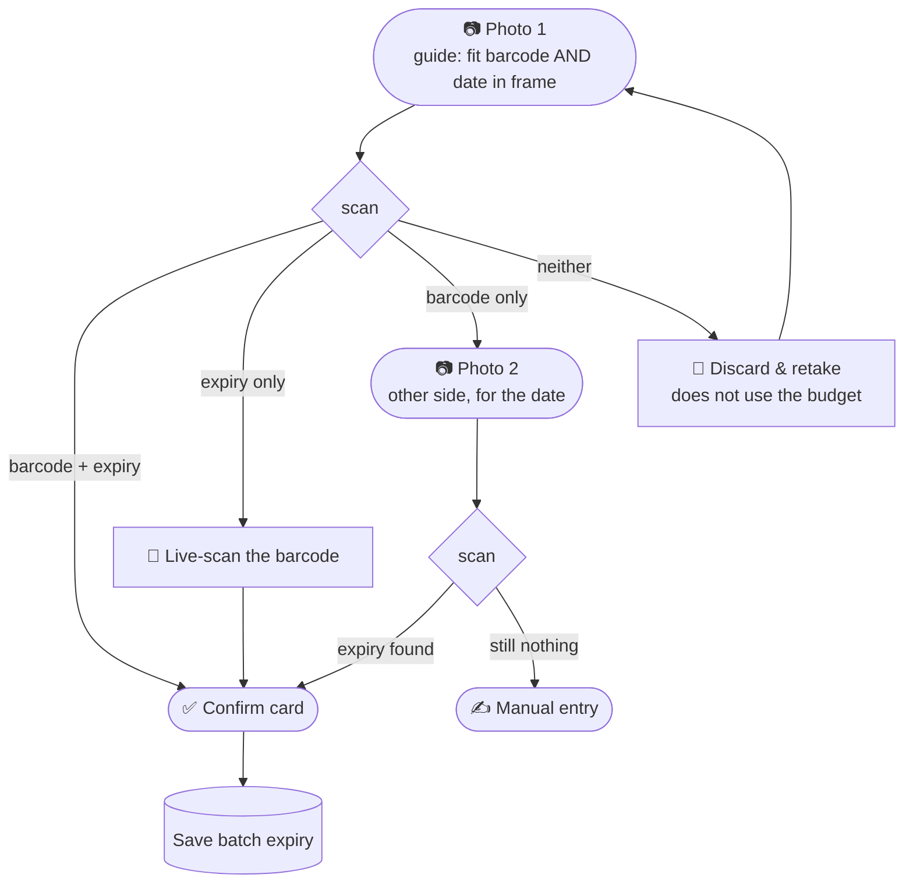

# Scanify — Frontend Plan

Capture flow for the mobile web app (PWA). This is a **planning document**,
not an implementation — it fixes the interaction model and the contract with
the backend so the UI can be built without re-litigating the decisions.

Backend it talks to: [`backend/app/scanner.py`](../backend/app/scanner.py) →
`scan(image)` returns barcode(s), raw OCR text, and a parsed expiry.

---

## 1. Two modes

| Mode | Purpose | Camera | Status |
|---|---|---|---|
| **Audit** | Identify a product on the shelf | Live barcode scan only | ⚠️ scope TBD — barcode + live camera is all that's confirmed |
| **Expiry capture** | Backfill the missing expiry date | Still photo + live scan fallback | ✅ designed below |

Everything below describes **Expiry capture**.

---

## 2. The core principle: slots, not labelled photos

The instinct is to think "photo 1 = barcode, photo 2 = expiry." Don't. The
employee should never have to declare what a photo is *for*, and the system
should never have to guess.

Instead the session has **two slots to fill**:

```
NEED:   [ product_id ]      [ expiry_date ]
```

Every photo is passed to `scan()` and whatever it yields drops into whichever
slot is still empty. The UI simply asks for **what is still missing**.

This collapses the "which side was photographed?" problem entirely — and it
means the same flow handles both the same-face and different-face cases
without the employee choosing a path.

**Budget: max 2 *useful* photos.** A photo that fills no slot is discarded and
does **not** count against the budget — otherwise two blurry shots would lock
someone out of a product they can plainly see.

---

## 3. The flow



### Why photo-first, not scan-first

A single photo makes a product/date mismatch **physically impossible** —
same frame, same pack. Leading with a live barcode scan would turn that
guarantee into a risk for the majority case that never needed it.

Live scanning is therefore demoted to a **rescue**: used only when the photo
already failed to find a barcode, which is the single largest failure bucket.

### Step 1 is where the accuracy is

Measured on the sample set: **only 36% of photos yielded both**, yet ~70% of
packs carry both on one face. The gap is pure framing — 22 of 58 photos had
no barcode in frame at all, and 5 more had it sliced by the frame edge.

> **The capture guide on step 1 is the highest-value element in the whole UI.**
> Show both targets, and hint live when a barcode is detected in view. This
> recovers more accuracy than any model change available to us.

---

## 4. Screens

### 4.1 Capture (step 1)

- Full-bleed camera
- **Framing guide**: two soft outlines — "barcode" and "date panel" — with copy
  like *"Fit the barcode and the date in one shot"*
- Live hint when a barcode is detected in frame (green tick) so they know
  before they press the shutter
- Shutter button; no mode toggles

### 4.2 Multi-barcode picker

Sample 42 in the test set contains **six** valid EAN-13 barcodes (a multipack
carton); sample 38 has two. Never silently take the first.

When `barcode.retail_count > 1`:

- Show the captured photo
- Draw a tap-target box over each detected barcode using **`box_norm`**
  (normalised 0–1, so it scales to any display size)
- Label each with its decoded value
- Employee taps the right one → that fills the `product_id` slot

```
values[].box_norm = { x, y, w, h }   // fractions of image width/height
values[].corners  = [[x,y], ...]     // exact quad if the code is rotated
```

### 4.3 Confirm card

The one screen the employee sees on the happy path.

- Product name (resolved from `product_id`)
- **Expiry date, large**
- ✏️ **Edit** — tap to correct the date inline
- Big accept button → ✅ green success, done

Treatment depends on `expiry.confidence`:

| Confidence | Measured | Treatment |
|---|---:|---|
| `high` | 22/44 | Date large + **green**. One tap to accept. |
| `medium` | 10/44 | Date + **amber** and the reason shown. Accept is a deliberate confirm, not a reflex tap — these are derived or heuristic reads. |
| `none` | 12/44 | Skip the card. Go straight to manual entry. |

Same tap count in the common case; friction only where the machine is unsure.

### 4.4 Second photo

- Appears **only when actually needed** — never show two empty slots up front,
  which would imply two photos are expected when ~70% finish in one
- Photo 1 shown as a **small thumbnail top-right** once photo 2 is being taken
- Show the **resolved product name** on screen while photographing the second
  side, so a wrong pack in hand is visually obvious

---

## 5. Failure messages come from the parser, not a generic retry

The parser reports *which* pattern it hit. Use it — telling someone to
re-photograph a pack that says "see below" wastes their time and burns trust.

| `expiry.pattern` | What it means | UI message |
|---|---|---|
| `E9_indirection` | pack says "as printed on pack" | **"Check another side"** — retaking this face is useless |
| `E4_mfg_only_shelf_life_unknown` | only a manufacture date; shelf life not on pack | **"Enter the date"** — the info isn't printed here |
| `E10_use_within_of_opening` | "use within 3 months of opening" | **No fixed expiry exists** — skip, don't make them hunt |
| `E11_missing_or_blank` | nothing readable | **"Try again"** — likely a bad photo |

Only `E11` deserves a retake prompt.

**Retry cap:** after 2–3 failed attempts, always offer manual entry. Never trap
someone in a retake loop.

---

## 6. Mismatch safeguards

A mismatch (barcode of product A, expiry of product B) is impossible in the
one-photo case and unavoidable in principle whenever two photos are needed.
Three cheap defences:

1. **Show the product name during step 2.** Once the barcode resolves, display
   it while they photograph the other side.
2. **Cross-check for free.** If the second image happens to contain a barcode
   too, compare it to the first. Different → hard flag, don't save.
3. **Keep both images on the record**, so a suspicious batch expiry can be
   audited later without a second warehouse pass.

---

## 7. What the frontend needs from the API

Currently `scan()` returns this shape (already implemented):

```jsonc
{
  "image": "samples2/sample 5.jpg",
  "image_size": { "w": 900, "h": 1600 },
  "barcode": {
    "ok": true, "count": 1, "retail_count": 1,
    "values": [{
      "value": "8906183110319", "format": "EAN13", "is_retail": true,
      "box":      { "x": 179, "y": 1127, "w": 414, "h": 165 },
      "box_norm": { "x": 0.199, "y": 0.704, "w": 0.46, "h": 0.103 },
      "corners":  [[195,1127], [593,1127], [593,1292], [179,1292]]
    }]
  },
  "ocr": { "ok": true, "line_count": 41, "lines": ["BATCH NO :4J13", "..."] },
  "expiry": {
    "expiry": "2026-09-12", "manufacture": "2024-09-13",
    "pattern": "E2_both_printed", "confidence": "high",
    "needs_review": false, "reason": "expiry label followed by V1 value",
    "warnings": [], "shelf_life_months": null, "candidates": ["..."]
  },
  "ms_total": 404.4
}
```

### Available now

| Endpoint | Purpose |
|---|---|
| `POST /scan` | multipart upload of one photo → the JSON above |
| `GET /health` | `{status, models_loaded, version}` |
| `GET /docs` | interactive OpenAPI docs (typed contract) |

```bash
cd backend && uvicorn app.api.main:app --reload
```

The API is **stateless** — no session endpoint is needed, because the
frontend holds the two slots and merges whatever each call returns.

Error responses carry a machine-readable code so the UI can pick the right
message: `empty_upload` (400), `unreadable_image` (415), `too_large` (413).

### Still needed (Phase 2)

- **Product lookup** by `product_id` → product name, for the confirm card.
  Until this exists, show the raw barcode number — and note that the
  mismatch safeguard in §6.1 is weaker without it.
- **Save** endpoint writing the confirmed expiry to the batch.
- Telemetry sinks for §8 (nothing is persisted in Phase 1).

### Two frontend obligations

- **Downscale to 1600px before uploading.** The backend resizes to that
  anyway, so this is lossless and turns a ~3.5 MB upload into ~300 KB —
  the slowest part of the round trip over warehouse Wi-Fi.
- **Serve over HTTPS.** `getUserMedia()` only works in a secure context
  (HTTPS or `localhost`). Testing on a real phone against a laptop IP
  fails silently without it.

---

## 8. Telemetry worth capturing from day one

These are cheap now and expensive to retrofit:

- **Every employee edit**, with the original OCR text alongside the correction —
  the best signal for which packs the parser struggles with
- **How often photo 1 yields both** — measures whether the framing guide is
  working, and it's the number that most affects throughput
- **Which failure pattern fired** — tells you where to spend effort next
- **Retake counts per product** — finds the packs that need a fixed capture
  station rather than an aisle photo

---

## 9. Open questions

- **Audit mode scope** — confirmed as barcode + live camera only; the rest of
  the feature is still to be defined
- **Offline queue** — is warehouse Wi-Fi reliable enough for immediate upload,
  or must captures be queued on-device from day one?
- **Manual entry format** — free text with a date picker, or a constrained
  DD/MM/YYYY input? A picker avoids re-introducing the parsing problem
- **Who resolves the product name** — is there an existing catalogue endpoint,
  or does the app need one built?

---

## 10. Decisions already settled (do not re-open without new data)

| Decision | Why |
|---|---|
| Photo first, live scan as fallback | One photo makes mismatch impossible; live scan is the rescue when no barcode is in frame |
| Slots, not labelled photos | The employee never declares intent; the system merges whatever each photo yields |
| Failed photos don't consume the budget | Otherwise two bad shots lock out a visible product |
| Multi-barcode always asks | Six valid codes appeared in one real sample |
| `medium` confidence never auto-saves | A wrong expiry marks a whole batch wrong; the parser returns 0 wrong dates today and that must not change |
